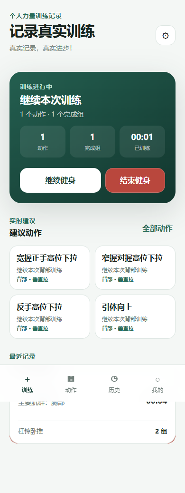
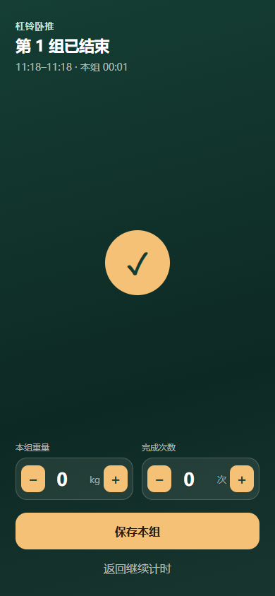
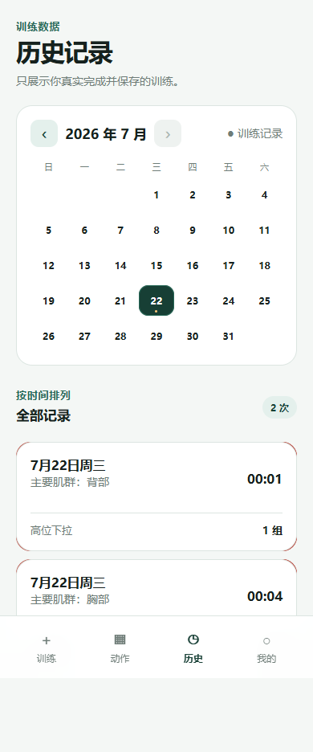
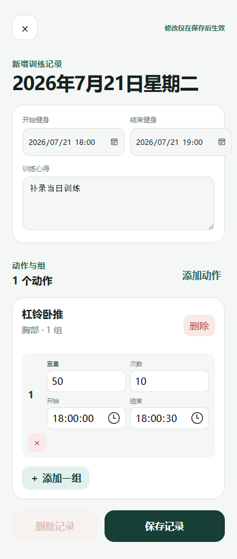
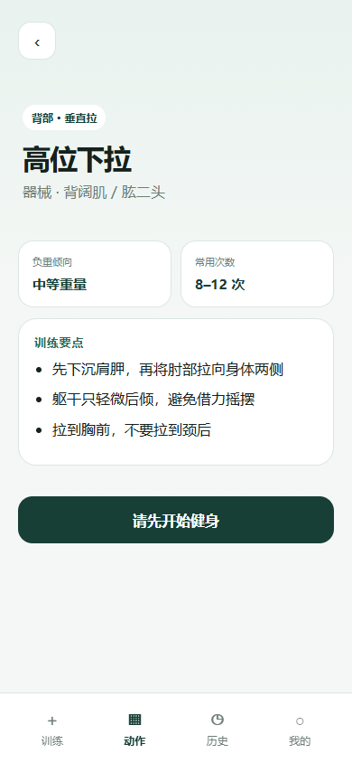
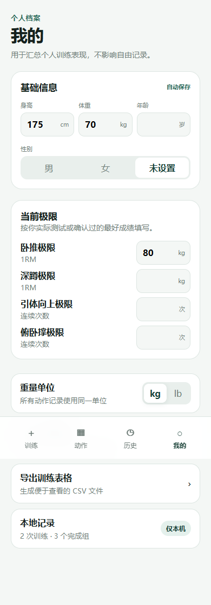

# 力记 · Strength Journal

一款面向个人使用的健身房力量训练记录 PWA。它不安排训练计划，也不要求注册账号，只负责准确记录训练总时长、动作、每组重量、次数、时间、组间歇和训练心得。

**在线使用：** [https://123455478478.github.io/strength-journal/](https://123455478478.github.io/strength-journal/)

## 别人如何使用

1. 用手机或电脑浏览器打开上面的在线地址。
2. 点击“开始健身”，应用从这一刻开始计算本次训练总时长。
3. 进入动作库选择动作；尚未开始健身时不能添加动作。
4. 在动作下点击“开始本组”，完成后点击“结束本组”。
5. 本组结束后填写实际重量和完成次数并保存；开始、结束和组间歇时间由应用自动计算。
6. 点击“结束健身”保存整次训练及总时长；训练进行中也可在首页直接点击红色“结束健身”。
7. 在结束总结页填写本次训练心得、状态或下次需要调整的地方。
8. 在“历史”日历中点击任意日期，可以查看、修改或补录当天的训练。

无需下载、注册或配置服务器。记录默认保存在当前浏览器中，建议定期在“我的”页面导出 JSON 备份。

## 核心功能

- 明确的“开始健身 / 结束健身”流程，自动记录整次训练总时长。
- 没有完成任何一组时结束健身，会直接丢弃本次记录；即使曾添加动作也不会阻止结束。
- 每个动作下逐组记录：开始本组 → 结束本组 → 填写重量与次数。
- 未开始的额外组可向左滑动删除。
- 重量提供 ±1 步进按钮，次数提供 ±1 步进按钮。
- 首页建议动作点击后先进入动作详情，与动作库中的动作点击逻辑一致。
- 新组默认沿用上一组；动作第一组默认参考上一次训练中同动作的第一组。
- 自动计算每组持续时间、动作内组间歇和动作总用时。
- 结束训练后可保存一段文字心得或备注。
- 历史日历标记训练日；支持按月向前翻页和一键回到本月，点击任意日期可新增或修改当日记录，记录卡片左滑可删除。
- 训练首页的总时长实时更新，并提供红色快捷结束按钮。
- “先添加一个动作”等带加号的空状态可以直接点击。
- 从动作详情点击“请先开始健身”时，会自动将当前动作作为本次训练的第一个动作。
- 动作库和动作详情始终保留底部导航，可直接切换训练、动作、历史和我的。
- 内置 67 个常见胸部、背部、肩部、手臂、腿部和核心动作。
- 核心动作覆盖腹部、抗伸展、抗旋转、侧腹和腰部稳定训练。
- 每个动作提供负重倾向、常用次数范围和关键注意事项。
- 根据最近训练记录和当前训练肌群实时排列建议动作，但不制定训练计划。
- 保存身高、体重、年龄、性别及卧推、深蹲、引体向上和俯卧撑极限。
- 支持 JSON 完整备份、恢复和 CSV 导出。
- 支持安装到手机主屏幕，首次联网访问后可离线打开。

## 计时定义

```text
本组持续时间 = 本组结束时间 - 本组开始时间
组间间歇 = 下一组开始时间 - 上一组结束时间
动作总用时 = 最后一组结束时间 - 第一组开始时间
训练总用时 = 训练结束时间 - 训练开始时间
```

即使锁屏、切换应用或关闭页面，重新打开后也会根据时间戳恢复计时状态。

## 界面预览

| 开始与建议动作 | 本组结束后填写 |
| --- | --- |
|  |  |

| 历史日历 | 修改或补录训练 |
| --- | --- |
|  |  |

| 动作详情 | 个人档案 |
| --- | --- |
|  |  |

## 数据与隐私

- 不需要注册或登录。
- 训练记录和个人档案默认只保存在当前浏览器的本地存储中。
- GitHub Pages、GitHub 仓库和开发者不会自动收到个人训练数据。
- 不同设备和浏览器之间不会自动同步。
- 清理浏览器站点数据会删除本地记录，请定期导出 JSON 备份。

## 安装到手机

1. 使用手机浏览器打开[在线应用](https://123455478478.github.io/strength-journal/)。
2. Android Chrome 选择“安装应用”或“添加到主屏幕”。
3. iPhone Safari 选择“分享”→“添加到主屏幕”。

## 本地运行

应用是无构建步骤的静态 PWA。进入 `prototype` 目录后启动任意静态文件服务器，例如：

```powershell
python -m http.server 4173
```

然后访问 `http://localhost:4173`。直接打开 `index.html` 可以体验主要功能，但 Service Worker 和离线缓存需要通过 localhost 或 HTTPS 运行。

## 项目结构

```text
strength-journal/
├── prototype/                   # 可直接部署的 PWA
├── .github/workflows/           # GitHub Pages 自动部署
├── PRODUCT_DESIGN.md            # 产品设计
├── SOFTWARE_DESIGN.md           # 软件设计
└── DEPLOYMENT.md                # 部署说明
```

推送到 `main` 分支后，GitHub Actions 会将 `prototype` 目录自动发布到 GitHub Pages，详见 [DEPLOYMENT.md](DEPLOYMENT.md)。

## 参考项目与资料

产品结构参考了开源健身记录项目中常见的“训练 → 动作 → 每组”数据层级和历史编辑方式：

- [Iron](https://github.com/kabouzeid/Iron)
- [Workout Tracker](https://github.com/jkaho/workout-tracker)
- [wger](https://github.com/wger-project/wger)

动作负重和次数倾向参考 ACSM 阻力训练的一般原则；动作执行要点参考 ACE Exercise Library 后整理为简短中文提示。内容仅用于一般健身信息展示，不替代教练评估、康复指导或医疗建议。

- [ACSM Resistance Training Guidelines](https://acsm.org/resistance-training-guidelines-update-2026/)
- [ACE Exercise Library](https://www.acefitness.org/resources/everyone/exercise-library/equipment/)
